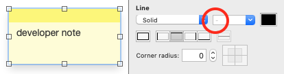
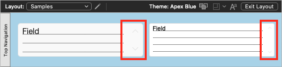
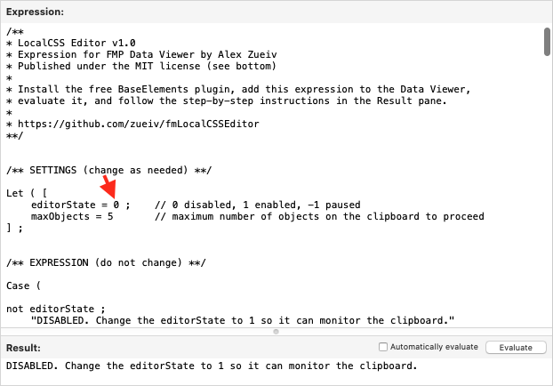
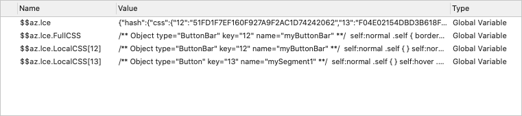
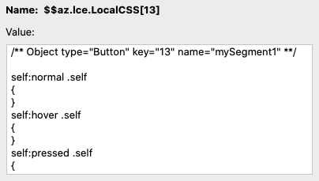
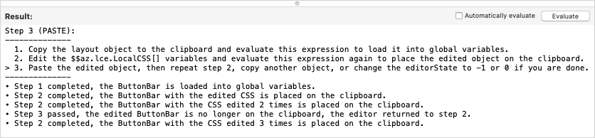
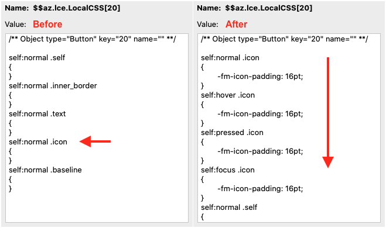
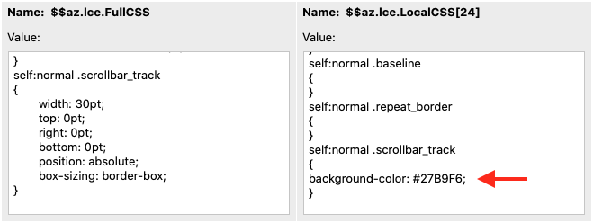
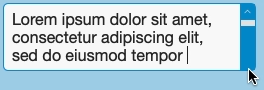

## LocalCSS Editor

* [Introduction](#intro)
* [How it works (download links)](#knowhow)
* [User interface](#ui)
* [Examples](#examples)
   * [Animated button (state selectors)](#button)
   * [Customized scrollbar (custom properties)](#scrollbar)

## Introduction

The Inspector in FileMaker Pro provides a great UI for designers of all experience levels, but because it uses a No-code approach, it hides many CSS features from us. A good example is the Developer Note style in the Apex Blue theme:

	

This dash symbol and the black color swatch indicate that this style assigns differens line thicknesses and colors to the borders on different sides of the Text object. Therefore, it is a well supported but hidden feature.

Other hidden features like scrollbar width don't even show up in the Inspector, but you can still have two objects with different scrollbar widths if you copy another object from a layout that's assigned a different theme:

	

LocalCSS Editor can give you access to all the hidden features by changing the way you design layout objects from No-code to Low-code. You'll still use the Inspector to control most of the object's properties, but you'll also be able to add a small piece of custom CSS to set a hidden property in three steps:

1. Copy the object to the clipboard
2. Edit its LocalCSS in the Data Viewer
3. Paste the modified object back

You can then save your style changes to propagate them to other objects, including the one you just copied.

## How it works

LocalCSS Editor is simply a large text expression that you need to add to the Watch tab in the Data Viewer. You can copy its latest version from the Releases page here:

* [https://github.com/zueiv/fmLocalCSSEditor/releases/download/latest/expression.txt](https://github.com/zueiv/fmLocalCSSEditor/releases/download/latest/expression.txt)

To use this expression, you need to install the free BaseElements plugin:

* [https://docs.baseelementsplugin.com/article/522-downloads](https://docs.baseelementsplugin.com/article/522-downloads)

This expression runs as an automated service that you can only enable, disable, or pause by changing the editorState variable in the outermost Let() statement. The outermost Case() statement checks this variable and stops evaluating the expression if it is disabled (0) or paused (-1):

	

When enabled (editorState = 1), this expression calls the BE_ClipboardFormats function every time it is evaluated to check whether the clipboard contains a layout object. If a new object appears on the clipboard, the expression tries to load it into global variables. When you change editorState to -1, the expression preserves its global variables so you can continue editing the loaded object, and when you change it to 0, the expression clears them. You should keep the expression paused or disabled when you are not using it.

## User interface

LocalCSS Editor does not provide any additional UI or event handlers. Its expression is evaluated along with other expressions that you store in the Data Viewer. So, to load the object you just copied to the clipboard, you may need to click the Refresh Values button on the Watch tab.

When LocalCSS Editor loads an object, it creates three global variables:

		$$az.lce

This variable stores internal data from the current edit session. You shouldn't touch it.

		$$az.lce.FullCSS

You can use this variable to view all the CSS properties set for the loaded object and copy them to LocalCSS.

		$$az.lce.LocalCSS[]

This repeating variable is where you edit the CSS properties of the loaded object. If the object contains nested objects, LocalCSS Editor creates multiple repetitions of this variable:

	

and fills each repetition with all the CSS selectors available in the corresponding object's FullCSS:

	

When you are done editing this variable in the Current tab of the Data Viewer, you need to switch to the Watch tab. The LocalCSS Editor expression will evaluate, recognize your changes, and put the modified object on the clipboard, which you can then paste into the layout. You can edit this variable multiple times, periodically switching between tabs and pasting the modified object into the layout to see the effect.

Note that LocaLCSS Editor checks its global variables first and then checks the clipboard. If you edit the LocalCSS of a loaded object, copy another object, and then switch to the Watch tab, it will replace that object in the clipboard. If you then copy any object again and click the Refresh Values button, it will load that object into the global variables, replacing the previously loaded one.

LocalCSS Editor uses the Result pane of the Edit Expression dialog as a console to show you what step you are currently on and what you have done previously:

	

The step history is saved as long as you edit the same object. When another object is loaded, the history is cleared.

LocalCSS Editor can't recognize whether you've completed or skipped step 3, but when it sees anything other than a modified layout object in the clipboard, it considers that step passed.

The Result pane may also display an error message if the plugin is missing or there are too many objects in the clipboard. For example, if you copy a Slide Control that contains hundreds of other objects, LocalCSS Editor will not clutter your Data Viewer with hundreds of global variables, but will display an error message. The maxObjects variable set in the outermost Let() statement is used to control this limit.

Typically you will only be editing the LocalCSS of one object, but if you copy two or more separate objects to the clipboard, LocalCSS Editor will load them all and merge their FullCSS definitions into one global variable. This can be used to compare and copy properties between objects, but in this case the text in the step history will be inaccurate since it will only refer to the first object, while the editor will process them all.

## Examples

### Animated button

CSS selectors that LocalCSS Editor reads from FullCSS are guaranteed to be supported, but that's not the end of it. For example, the Default style button in the Apex Blue theme only contains one .icon CSS selector for the :normal state, but if you change the Button:Icon Padding option in the Inspector, it will duplicate the entered value for all four states. You can see this if you load the button into LocalCSS Editor before and after the changes:

	

For some reason, the Inspector doesn't allow us to set different icon paddings for different button states; FileMaker will remove these duplicate properties when you save the layout, but if you set them to different values using LocalCSS Editor, they will persist. That is, you can add other selectors, at least for different states of the object.

The following CSS modifies a button assigned the Primary style from the Apex Blue theme so that its icon moves 3 poins to the right when hovered over, and another 3 points when clicked, while its label remains in a fixed position:

		self:hover .inner_border
		{
		   padding-right: 6pt;
		}
		self:hover .icon
		{
		   -fm-icon-padding: 12pt;
		}
		self:pressed .inner_border
		{
		   padding-right: 3pt;
		}
		self:pressed .icon
		{
		   -fm-icon-padding: 15pt;
		}

.inner_border is the invisible container inside the button object that contains both the label and the icon. When you change the Padding options of an entire Button in the Inspector, it sets the properties for that selector. So you can set them there one at a time, but it's easier to enter a list of related properties (9+9=6+12=3+15) using LocalCSS Editor.

### Customized scrollbar

You can add properties that FullCSS doesn't have. For example, if you load a portal or field with a scrollbar enabled into LocalCSS Editor, you will only see the width and position properties in the .scrollbar_track selector, but if you add a background-color property, FileMaker will handle it well:

	

FileMaker accepts hex values and converts them into parameters of the rgba() function, but if you try to specify a color using its name, FileMaker will consider this an error and remove that property from the pasted object.

FileMaker is quite effective at parsing CSS. It removes all properties it cannot recognize, commented out properties, and empty selectors. If you force LocalCSS Editor to put an object with empty selectors on the clipboard, that object will remain unchanged when you paste it into the layout.

You don't have to start each property with a tab character. The only required whitespaces are around curly braces and after the colon character.

When you change the width of a portal's scrollbar, you also need to change its "right" property for the .contents selector to the same value:

		self:normal .scrollbar_track
		{
		   width: 15pt;
		}
		self:normal .contents
		{
		   right: 15pt;
		}

and when you change the field's scrollbar width, you also need to change its "right" property for the .text selector.

The following CSS reduces the scrollbar width of the Default style field from the Apex Blue theme to 15 points and displays it in a color that matches the border color when the field is active:

		self:normal .text
		{
		   right: 15pt;
		}
		self:normal .scrollbar_track
		{
		   width: 15pt;
		}
		self:focus .scrollbar_track
		{
		   background-color: #0091CE;
		}

Note that this background color makes top and bottom buttons invisible on the scrollbar when hovering over them:

	

The properties of these buttons and the scrollbar thumb cannot be changed using the .scrollbar_track selector because they are defined at the theme level for a different element:

		portal:normal .scrollbar_track {
		  width: 30pt;
		}
		text_area:normal .scrollbar_track {
		  width: 30pt;
		}
		scrollbar:hover .scrollbar_top_button {
		  -fm-icon-color: #0091ce;
		}
		scrollbar:normal .scrollbar_thumb {
		  background-color: #e6e6e6;
		}
		scrollbar:hover .scrollbar_bottom_button {
		  -fm-icon-color: #0091ce;
		}

So you should probably either choose a different color or change the properties of the "scrollbar" element using [Theme Editor](https://community.claris.com/en/s/contentdocument/0690H000005WFhxQAG) and [Theme Importer](https://community.claris.com/en/s/contentdocument/0690H000005WFiWQAW).
